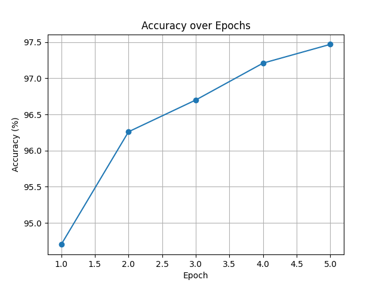

# MNIST Digit Classifier
This project implements a simple Convolutional Neural Network (CNN) in PyTorch to classify handwritten digits from the MNIST dataset. The model is trained and evaluated inside a GPU-enabled Docker container.

##  Objective

The goal is to demonstrate image processing at scale by training a digit classification model on the MNIST dataset using GPU acceleration and managing input/output across container boundaries.

##  Technologies Used

- Python 3
- PyTorch
- Matplotlib (for visualization)
- Docker with NVIDIA CUDA support

##  Project Structure

```
.
├── data/                   # Empty folder where MNIST data is downloaded
├── output/                 # Output folder (logs + accuracy plots)
├── mnist_cnn.py            # Main Python script (training + evaluation)
├── run.sh                  # Script to launch training inside container
├── requirements.txt        # Python dependencies
├── Dockerfile              # Build instructions for container
└── README.md               # This file
```

##  How to Run

### 1. Build Docker Image

```bash
docker build -t mnist_clasifier .
```

### 2. Run Container with GPU and Mounted Volumes


```bash

 docker run --rm -it --gpus all -v ${PWD}/output:/app/output mnist_clasifier
```


##  Output

After training, you will find in the `output/` folder:

- `mnist_log.txt`: log of training progress and final accuracy
- `accuracy_plot.png`: plot of accuracy per epoch

##  Example Output



##  Notes

- All data and results persist via volume mounts.
- Designed to run with Docker + NVIDIA Container Toolkit on Windows, Linux, or WSL2.
- No manual image downloads required — MNIST is downloaded automatically.

---

